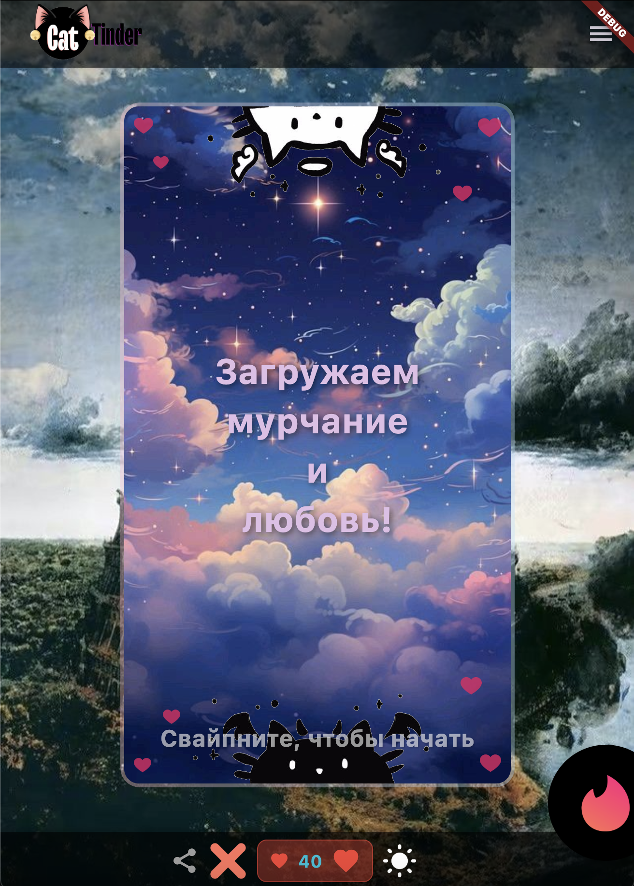
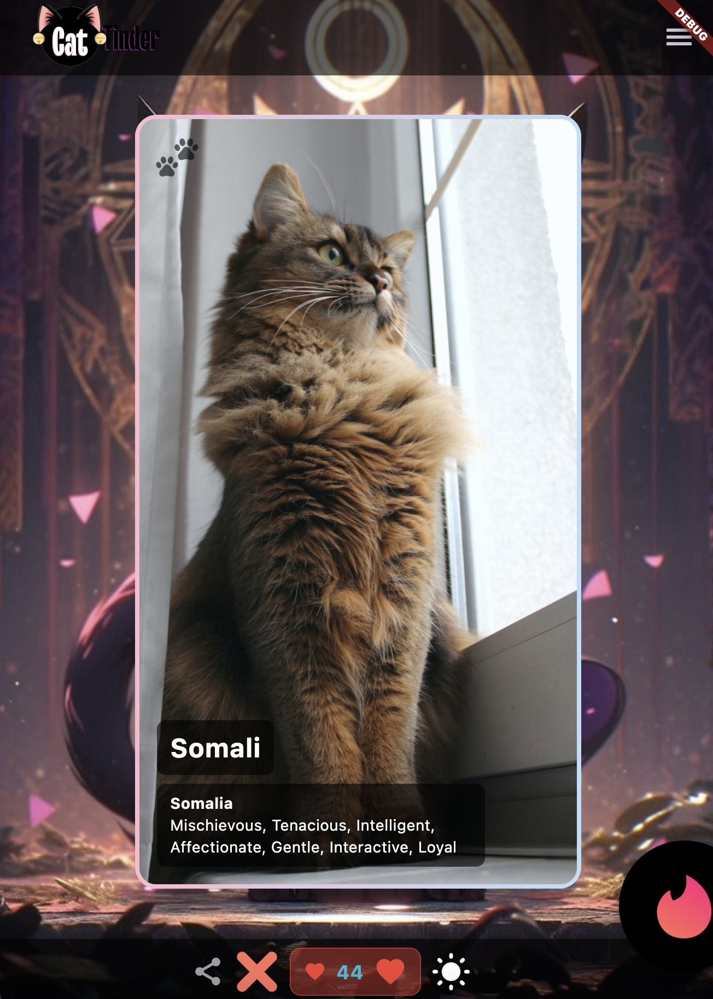
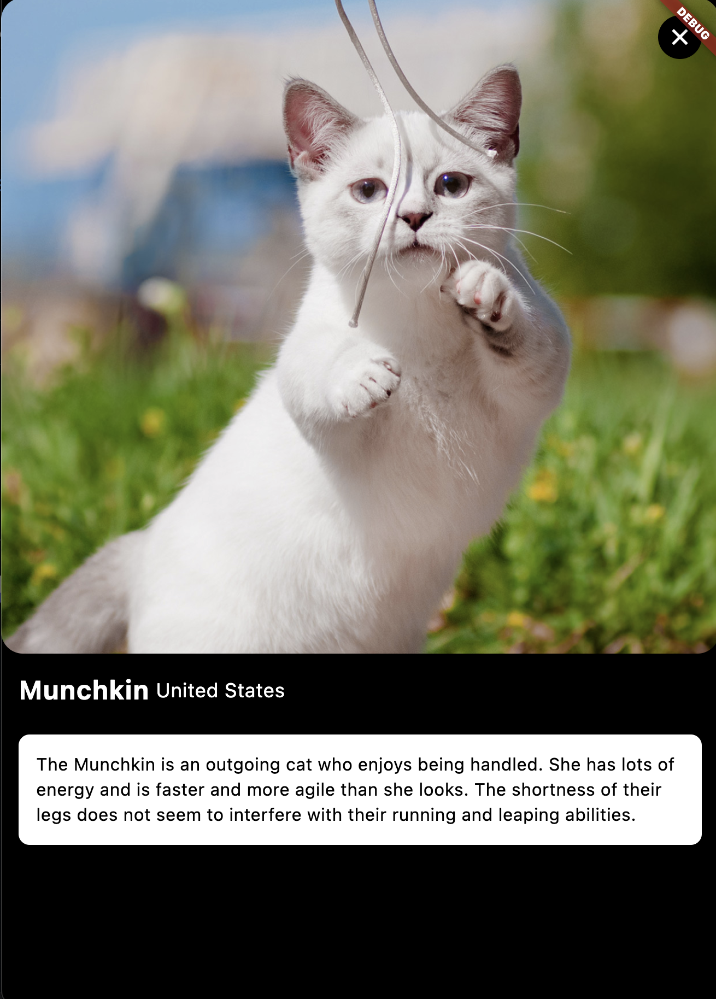
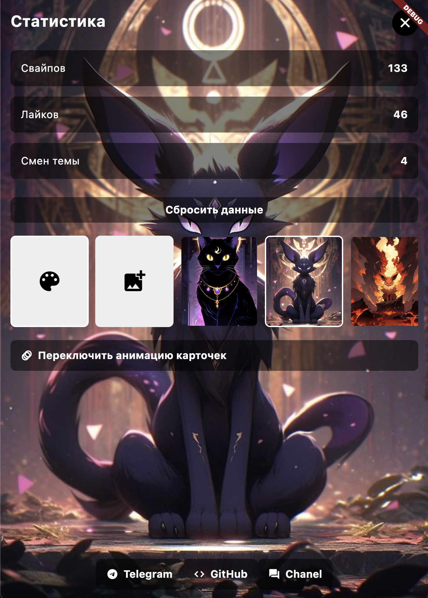

# CatTinder App

**Cat Tinder** — это приложение для любителей котиков, которое позволяет вам наслаждаться случайными изображениями кошек, узнавать о их породах и сохранять понравившиеся картинки. Приложение сочетает в себе простоту использования, красивый интерфейс и множество дополнительных функций, которые делают процесс взаимодействия с котиками ещё более увлекательным.

---

## Основные функции

### Главный экран
- **Случайное изображение котика**: При запуске приложения на главном экране отображается случайное изображение котика и название его породы.
- **Свайп/смах**: Вы можете свайпнуть или смахнуть изображение влево или вправо, чтобы перейти к следующему котику.
- **Лайк/дизлайк**: На экране есть две кнопки — лайк и дизлайк. Нажатие на них или свайп в соответствующую сторону меняет котика на нового.
- **Счетчик лайков**: Если вы лайкнули котика (свайп вправо или нажатие на кнопку лайка), счетчик лайков увеличивается.
- **Детальное описание**: При нажатии на изображение котика открывается экран с детальным описанием породы, где отображается вся доступная информация.

### Дополнительные функции
- **Приветственная карточка**: При первом запуске приложения появляется приветственная карточка, которую нужно свайпнуть, чтобы начать использование.
- **Выбор типа свайпа**: В настройках можно выбрать один из двух типов свайпа:
    - **Динамичный-плавный**: Плавный свайп с анимацией.
    - **Статичный с видимым стеком**: Свайп с видимым стеком изображений.
- **Кнопка "Поделиться"**: Вы можете поделиться понравившейся картинкой котика с друзьями.
- **Смена темы**: В настройках можно выбрать тему приложения, которая меняет API для загрузки изображений:
    - **The Cat API** (https://api.thecatapi.com)
    - **Nekosia API** (https://api.nekosia.cat)
- **Статистика**: В меню можно посмотреть статистику лайков и дизлайков, а также сбросить её.
- **Настройка фона**: Вы можете выбрать фон для приложения:
    - Один из предложенных фонов.
    - Монотонный фон на основе выбранного цвета из палитры.
    - Загрузить своё фото в качестве фона.

---

## Интерфейс приложения

### Приветствие

### Главный экран

### Экран детального описания

### Настройки

---

## Как использовать

1. **Запустите приложение**: При первом запуске вы увидите приветственную карточку. Свайпните её, чтобы начать.
2. **Свайпайте котиков**: Используйте свайп влево или вправо, чтобы переключаться между котиками. Также можно использовать кнопки лайк и дизлайк.
3. **Лайкайте котиков**: Если котик вам понравился, свайпните вправо или нажмите на кнопку лайка. Счетчик лайков увеличится.
4. **Откройте детальное описание**: Нажмите на изображение котика, чтобы открыть экран с детальной информацией о породе.
5. **Настройте приложение**: Перейдите в настройки, чтобы выбрать тип свайпа, сменить тему, настроить фон и посмотреть статистику.

---

## Скачать приложение

Вы можете скачать актуальную версию APK по [этой ссылке](relese/app-release.apk).

---
## Технологии

- **Фреймворк**: [Flutter](https://flutter.dev) (кроссплатформенная разработка для Android, iOS, Web, Windows, macOS, Linux)
- **Язык программирования**: Dart
- **Состояние приложения**: Управление состоянием с помощью [Provider](https://pub.dev/packages/provider)
- **HTTP-клиент**: [Dio](https://pub.dev/packages/dio) и [http](https://pub.dev/packages/http) для работы с API
- **Кэширование изображений**: [cached_network_image](https://pub.dev/packages/cached_network_image) для загрузки и кэширования изображений
- **Локальное хранилище**: [shared_preferences](https://pub.dev/packages/shared_preferences) для хранения настроек и данных
- **Выбор изображений**: [image_picker](https://pub.dev/packages/image_picker) для загрузки пользовательских фонов
- **Выбор цвета**: [flutter_colorpicker](https://pub.dev/packages/flutter_colorpicker) для выбора монотонного фона
- **Поделиться контентом**: [share_plus](https://pub.dev/packages/share_plus) для возможности поделиться изображением
- **Запуск URL**: [url_launcher](https://pub.dev/packages/url_launcher) для открытия внешних ссылок
- **Работа с файловой системой**: [path_provider](https://pub.dev/packages/path_provider) для доступа к путям файловой системы
- **Управление разрешениями**: [permission_handler](https://pub.dev/packages/permission_handler) для запроса разрешений
- **Иконки приложения**: [flutter_launcher_icons](https://pub.dev/packages/flutter_launcher_icons) для генерации иконок

### API для изображений
- [The Cat API](https://api.thecatapi.com)
- [Nekosia API](https://api.nekosia.cat)

### Дополнительные инструменты
- **Линтинг**: [flutter_lints](https://pub.dev/packages/flutter_lints) для соблюдения лучших практик в коде

### Структура проекта
- **Ассеты**: Изображения и фоны хранятся в папке `assets/`.
- **Иконки**: Иконки приложения генерируются с помощью `flutter_launcher_icons`.
- **Мультиплатформенность**: Поддержка Android, iOS, Web, Windows, macOS и Linux.

---

## Контакты

Если у вас есть вопросы или предложения по улучшению приложения, пожалуйста, свяжитесь со мной:

- **Email**: example@example.com
- **GitHub**: [github.com/yourusername](https://github.com/yourusername)

---

Наслаждайтесь приложением и пусть котики приносят вам радость каждый день! 🐾