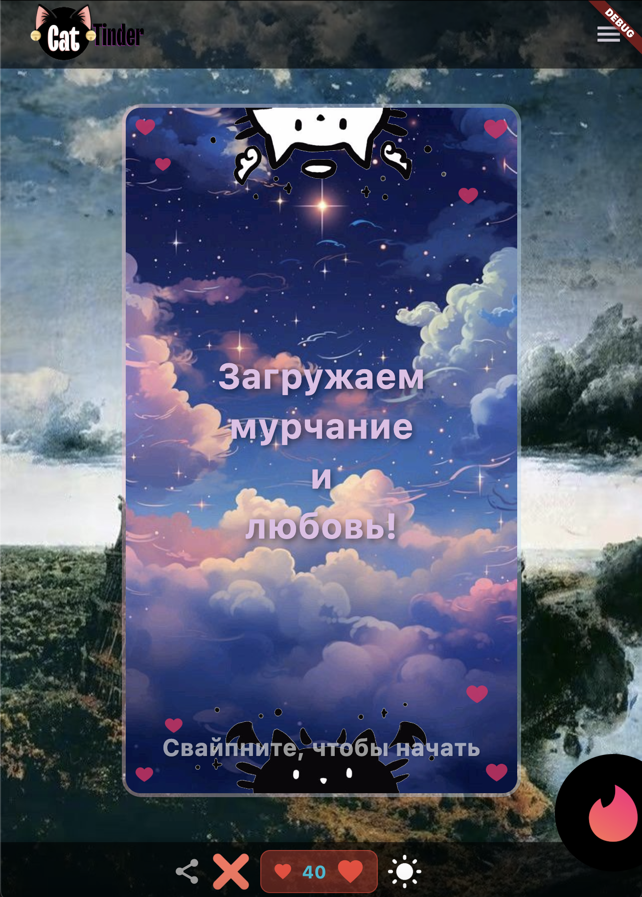
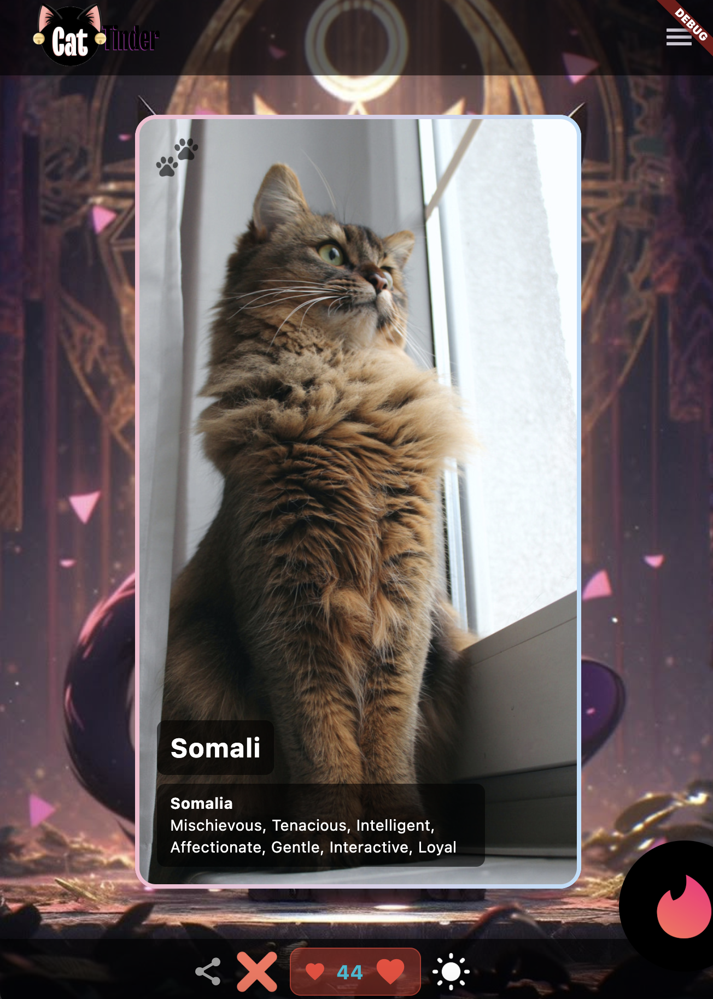
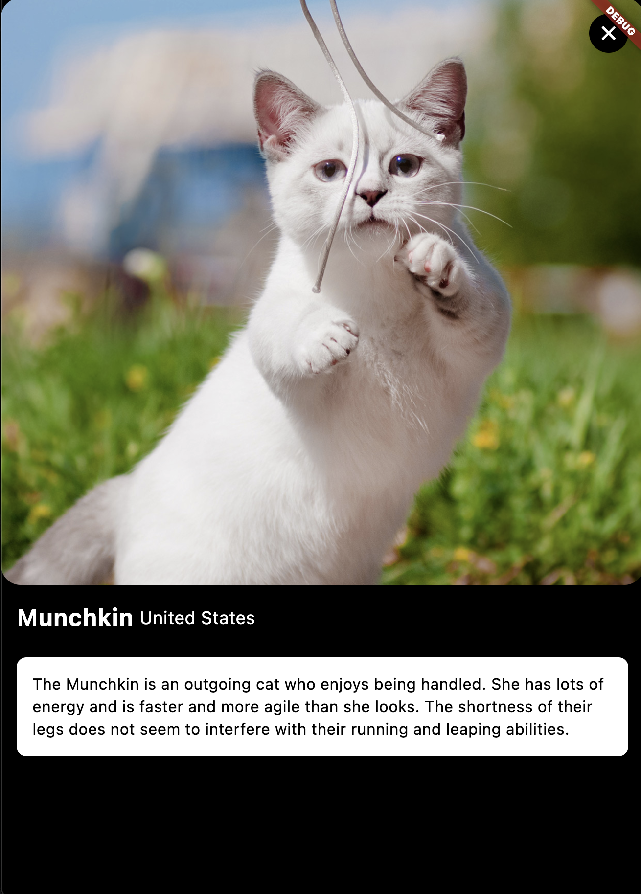
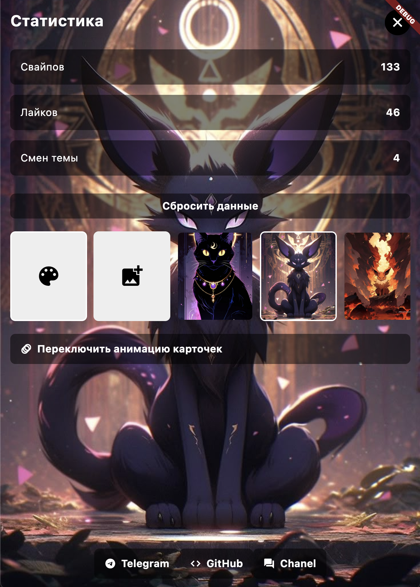
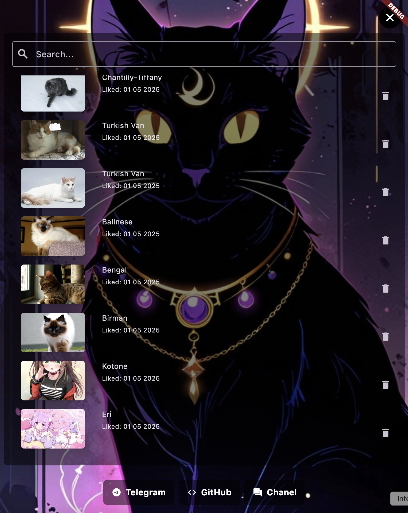
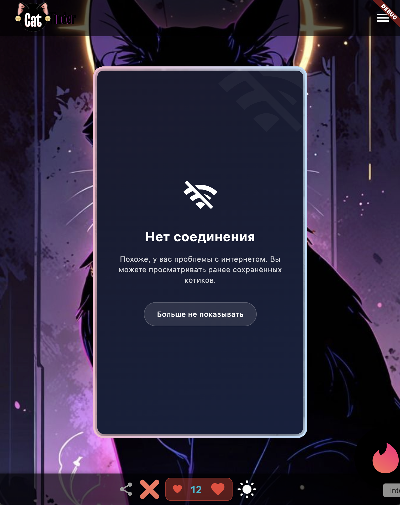

# CatTinder App

**Cat Tinder** — это приложение для любителей котиков, которое позволяет вам наслаждаться случайными изображениями кошек, узнавать о их породах и сохранять понравившиеся картинки. Приложение работает как онлайн, так и офлайн, сохраняя ваши лайки в галерею и базу данных.

---

## Основные функции

### Главный экран
- **Случайное изображение котика**: При запуске приложения на главном экране отображается случайное изображение котика и название его породы.
- **Свайп/смах**: Вы можете свайпнуть или смахнуть изображение влево или вправо, чтобы перейти к следующему котику.
- **Лайк/дизлайк**: Нажатие на кнопки или свайп в соответствующую сторону меняет котика на нового.
- **Сохранение лайков**: Лайкнутые карточки автоматически сохраняются в галерею приложения и в локальную базу данных.
- **Офлайн-режим**: При отсутствии интернета приложение показывает сохранённые в БД лайкнутые карточки.
- **Инфокарточки**: Если нет интернета или нечего показывать, отображаются информационные карточки.

### Дополнительные функции
- **Приветственная карточка**: При первом запуске появляется приветственная карточка.
- **Выбор типа свайпа**: В настройках можно выбрать тип свайпа:
  - Плавный с анимацией
  - С видимым стеком изображений
- **Кнопка "Поделиться"**: Поделитесь понравившейся картинкой.
- **Смена темы**: Выбор между The Cat API и Nekosia API.
- **Статистика**: Просмотр статистики лайков/дизлайков.
- **Настройка фона**: Выбор фона из предложенных или загрузка своего.

---

## Офлайн-функциональность

Приложение автоматически переключается в офлайн-режим при отсутствии интернета:
- Показывает сохранённые в БД лайкнутые карточки
- Отображает инфокарточки, если сохранённых карточек нет
- Все данные синхронизируются при восстановлении соединения
- 
---

## Интерфейс приложения

### Приветствие

### Главный экран

### Экран детального описания

### Настройки

### Галерея сохранённых карточек

### Офлайн-режим

---

## Как использовать

1. **Свайпайте котиков**: Лайкайте понравившихся — они сохранятся в галерею и БД
2. **Работайте офлайн**: При отсутствии интернета просматривайте сохранённые карточки
3. **Настройте приложение**: Выберите тип свайпа, тему и фон

---

## Скачать приложение

Актуальная версия APK доступна по [этой ссылке](relese/app-release.apk).

---
## Технологии

- **Фреймворк**: Flutter
- **Локальное хранилище**: Hive/SQLite для сохранения лайков
- **Офлайн-кэширование**: cached_network_image с поддержкой офлайн-доступа
- **Проверка соединения**: connectivity_plus для определения статуса сети

### API для изображений
- The Cat API
- Nekosia API

---

Наслаждайтесь котиками в любое время, даже без интернета! 🐾